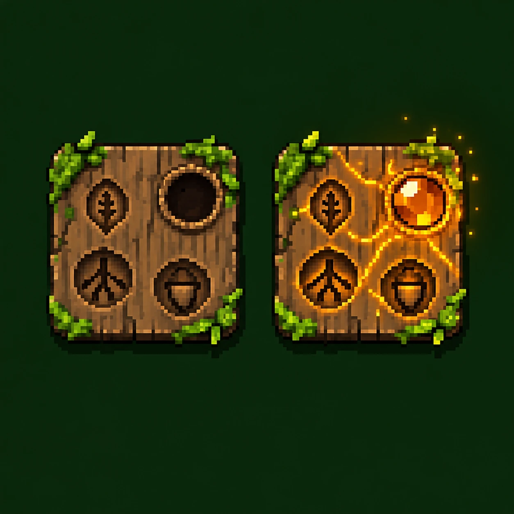

# Wald-Coop: Tafel-Skillsystem und Fähigkeitenpool

## Überblick

Der Skillbaum ist die einzige Meta-Progression: Vor dem Run baut man ihn aus gefundenen Tafeln (Skillbaumfragmente), im Run lernt man seine Fähigkeiten mit Skillpunkten. Level und Items beginnen jeden Run bei null.

*Links eine leere Holztafel mit 3 Naturfähigkeiten und leerem Sockel, rechts dieselbe Tafel mit gesockeltem Bernstein.*

- **Tafeln:** werden in Runs gefunden und bleiben dauerhaft. Eine intakte Holztafel trägt 3 zufällige Naturfähigkeiten eines Themas und einen leeren Sockel. Tafeln können aber kaputt sein: Dann haben sie nur 1 oder 2 Fähigkeiten, und der Sockel kann fehlen. Ohne Sockel lässt sich kein Stein einsetzen. Ein gesockelter Stein schaltet eine vierte, magische Fähigkeit frei und bindet die Tafel dauerhaft an ihren Platz.
- **Raster:** Tafeln sind viereckig und liegen auf einem Quadratraster um den Klassenstein (Kern). Benachbart sind Tafeln, die sich an einer Kante berühren (oben, unten, links, rechts), Diagonalen zählen nicht. Der Ring ist die Entfernung vom Kern in Schritten über Nachbarn, also Ring 1 sind die vier Tafeln direkt am Kern.
- **Pfade und Ausgänge:** Zwischen den Tafeln führen Pfade. Um von einer Tafel auf die nächste zu kommen, muss man durch einen vorgefertigten Ausgang an der Kante gehen. Nicht jede Tafel hat an jeder Kante einen Ausgang, manche haben nur wenige. Die Ausgänge stehen beim Fund fest. Eine gute Tafel mit vielen Ausgängen zu finden, ist also auch Glück. Der Kern hat an allen vier Kanten einen Ausgang.
- **Coop-Deckel:** Die Tafelanzahl des schwächsten Spielers begrenzt alle. Stärkere wählen einen Ausschnitt, der über Ausgänge zusammenhängt und am Kern hängt. Der Kern zählt nicht mit.
- **Skillpunkte:** Erfahrung wird geteilt, beide steigen gleichzeitig auf. Pro Level-Up gibt es 1 Skillpunkt, bis zum Endboss etwa 15.
- **Verbindungen in der Tafel:** Die Fähigkeiten einer Tafel, also die Holzfähigkeiten und die Magiefähigkeit, sind nicht frei wählbar, sondern durch Pfade miteinander verbunden. Welche Fähigkeit mit welcher verbunden ist, wird beim Fund zufällig gewürfelt und bleibt fest. Eine Fähigkeit ist lernbar, sobald ein Pfad zu ihr führt, dessen anderes Ende schon gelernt ist. Das gilt auch für die Magiefähigkeit: Sie ist erlernbar, sobald ein Pfad von einer gelernten Fähigkeit zu ihr führt. Manche Tafeln haben die Magie also direkt neben dem Einstieg, bei anderen liegt sie hinter zwei oder drei Holzfähigkeiten.
- **Erreichbarkeit:** Tafeln am Kern sind von Anfang an erreichbar. Weitere Tafeln werden erreichbar, sobald in einer über einen Ausgang verbundenen Tafel eine Fähigkeit gelernt wurde. Eine bloß angrenzende Tafel ohne Ausgang dazwischen zählt nicht. Innerhalb einer Tafel gelten die Verbindungen zwischen ihren Fähigkeiten (siehe **Verbindungen in der Tafel**).
- **Starke Tafeln:** Holztafeln mit starker Fähigkeit aus Zone 3 oder tiefer dürfen nur ab Ring 2 liegen. Gesockelte Tafeln müssen zusätzlich im Mindestring ihres Steins liegen.
- **Im Run:** Lernen nur außerhalb von Begegnungen, kein Umverteilen.

## Startklassen

Jeder Klassenstein trägt nur 3 feste Fähigkeiten mit je 1 Rang, also 3 Punkte. Er ist immer dabei und sichert die Identität der Klasse. Der Rest der Punkte fließt in die Tafeln, damit der Kern die Tafeln nicht verdrängt.

### Holzfäller

Nahkampf und Tank. Startet mit einer Axt und trägt doppelt so viel Holz für Barrikaden.

| Fähigkeit | Wirkung | Ränge | Hook |
| --- | --- | --- | --- |
| Kräftiger Hieb | +1 Nahkampfschaden. Ein Baum fällt mit 2 statt 3 Hieben | 1 | `stat` |
| Zähigkeit | +6 maximale HP | 1 | `stat` |
| Spalthieb (aktiv) | Trifft das Ziel und das Feld dahinter, +2 Schaden, Abklingzeit 10 Runden | 1 | `active` |

### Waldläuferin

Fernkampf und Späherin. Startet mit einem Bogen und 10 Pfeilen, die man wieder aufsammeln kann.

| Fähigkeit | Wirkung | Ränge | Hook |
| --- | --- | --- | --- |
| Scharfes Auge | +2 Sichtweite, sie sieht durch Unterholz | 1 | `stat` |
| Leichtfüßig | +15 % Ausweichen | 1 | `stat` |
| Durchschuss (aktiv) | Pfeil trifft alle Gegner in einer Linie bis zum nächsten Baum, +2 Schaden, Abklingzeit 12 Runden | 1 | `active` |

## Themen der Holztafeln

Jede Holztafel gehört zu einem Thema. Das Thema bestimmt, aus welchem Pool die Naturfähigkeiten der Tafel stammen. Eine intakte Tafel zieht daraus 3 der 6 normalen Fähigkeiten. Die starke Fähigkeit eines Themas gibt es nur auf Tafeln aus Zone 3 oder tiefer.

Themen sind unabhängig von Klasse und Edelsteinen: Die Klasse gibt die 3 Kern-Fähigkeiten, der Edelstein die magische Fähigkeit. Alles andere kommt aus den Themen der Tafeln. Man kann Tafeln verschiedener Themen mischen, um seinen Build zu bauen.

Jedes Thema hat ein eigenes Aussehen (Holzart, Randfarbe, Zierelement), damit man es auf einen Blick erkennt, auch auf dem kleinen Handy-Display. Gesockelte Tafeln behalten das Aussehen ihres Themas, leuchten aber zusätzlich in der Farbe ihres Steins.

| Thema | Ausrichtung | Holz | Randfarbe | Zierelement |
| --- | --- | --- | --- | --- |
| Eiche | Verteidigung und Holz | dunkles, grobes Eichenholz | Eisenbeschläge, grau | Eichenblatt und Eichel, breite Tafel mit dickem Rand |
| Moos | Heilung und Wissen | helles, feuchtes Holz | dickes grünes Moos | Pilze und Farn, weicher bewachsener Rand |
| Dorn | Gift, Fallen und Kontrolle | verwittertes, graues Holz | dunkelrot bis violett | Dornenranken, kleine Zacken am Rand |
| Lagerfeuer | Nahrung und Versorgung | verkohltes Holz | Glutkante in Orange | Flamme |

## Thema Eiche: Verteidigung und Holz

Eiche hält die Linie und nutzt Bäume als Deckung und Waffe.

| Fähigkeit | Wirkung | Ränge | Hook |
| --- | --- | --- | --- |
| Rindenhaut | +1 Rüstung pro Rang, doppelt, solange ein Baum an dich grenzt | 3 | `stat` |
| Wurzelstand | Wartest du eine Runde, erhältst du 3 Schild pro Rang und kannst bis zu deinem nächsten Zug nicht zurückgestoßen werden | 2 | `on_wait` |
| Gezielter Fall | Du bestimmst die Fallrichtung gefällter Bäume, die Fall-Linie macht 50 % mehr Schaden | 1 | `on_tree_felled` |
| Bollwerk | Barrikaden halten doppelt so viel aus. Rang 2: Bauen kostet keine Runde | 2 | `stat` |
| Herausforderung (aktiv) | Gegner im Umkreis von 3 Feldern greifen 3 Runden lang bevorzugt dich an, Abklingzeit 15 Runden | 1 | `active` |
| Schützender Ast (Coop) | Wird ein angrenzender Verbündeter getroffen, übernimmst du 25 % pro Rang des Schadens | 2 | `on_ally_hit` |
| Eichenherz (stark) | Einmal pro Etage überlebst du einen tödlichen Treffer mit 1 HP und bist 2 Runden unverwundbar | 1 | `on_lethal_damage` |

## Thema Moos: Heilung und Wissen

Moos hält die Gruppe am Leben und macht Unbekanntes lesbar.

| Fähigkeit | Wirkung | Ränge | Hook |
| --- | --- | --- | --- |
| Moosbett | Außerhalb von Begegnungen regenerierst du 50 % schneller pro Rang | 2 | `on_tick` |
| Pilzkunde | Der erste unbekannte Pilz pro Etage wird beim Aufheben erkannt. Rang 2: die ersten zwei | 2 | `on_item_pickup` |
| Baumflüsterer | Du erkennst getarnte Baumwesen in deinem Sichtfeld, und sie werden auch für deinen Mitspieler markiert | 1 | `on_fov_update` |
| Sporenwolke (aktiv) | Heilt dich und angrenzende Verbündete um 5 pro Rang, Abklingzeit 20 Runden | 3 | `active` |
| Heilende Hände (Coop) | Wiederbeleben dauert nur eine Runde, der Wiederbelebte steht mit 30 % statt 10 % HP auf | 1 | `on_revive` |
| Geteilte Mahlzeit (Coop) | Heilst du dich, erhält der nächste Verbündete im Umkreis von 5 Feldern 25 % pro Rang davon | 2 | `on_heal` |
| Wiedererblühen (stark) | Einmal pro Run: Wird ein Verbündeter niedergeschlagen, während du stehst, erhebt er sich nach 3 Runden selbst mit 50 % HP | 1 | `on_ally_downed` |

## Thema Dorn: Gift, Fallen und Kontrolle

Dorn kontrolliert das Feld und macht Schaden über Zeit.

| Fähigkeit | Wirkung | Ränge | Hook |
| --- | --- | --- | --- |
| Giftdorn | Angriffe vergiften: 1 Schaden pro Rang und Runde, 5 Runden lang | 3 | `on_attack` |
| Stachelpanzer | Wer dich im Nahkampf trifft, erleidet 2 Schaden pro Rang | 2 | `on_hit_taken` |
| Fallensteller | Du siehst versteckte Fallen im Umkreis von 3 Feldern. Rang 2: Du kannst Fallen aufnehmen und neu legen | 2 | `on_fov_update` |
| Dornenhecke (aktiv) | Pflanzt eine Hecke, die Gegner verlangsamt und vergiftet. 2 Ladungen pro Etage, Rang 2: 4 | 2 | `active` |
| Rankenfessel (aktiv) | Wurzelt einen Gegner in Sichtweite 3 Runden fest, Abklingzeit 20 Runden | 1 | `active` |
| Umschlingen (Coop) | Trifft ein Verbündeter einen von dir vergifteten Gegner, wird dieser eine Runde festgewurzelt, höchstens alle 5 Runden pro Gegner | 1 | `on_damage` |
| Dornenkrone (stark) | Gift stapelt sich unbegrenzt, ab 10 Stapeln platzt der Gegner und vergiftet alle Nachbarn | 1 | `on_status_applied` |

## Thema Lagerfeuer: Nahrung und Versorgung

Lagerfeuer nutzt das Hunger-System: Es macht Nahrung zu einer Stärke, lässt Tiere jagen und am Feuer kochen und gibt der Gruppe Rast und Wärme. Die Fähigkeiten dieses Themas sind noch offen.

## Edelsteine

Ein Stein im Sockel einer Holztafel schaltet deren vierte, magische Fähigkeit frei. Je tiefer die Zone, desto stärker und dunkler die Magie.

| Stufe | Steine | Magie | Fundort | Mindestring |
| --- | --- | --- | --- | --- |
| Natur | Jade, Bernstein | Wachstum, Heilung, Bewahren | mittlere Zonen | 1 |
| Elementar | Topas, Saphir | Feuer und Blitz, Wasser und Eis | höhere Zonen | 2 |
| Dunkel | Rubin, Onyx | Blut, Nekromantie | letzte Ebenen | 3 |
| Licht | Diamant | starke Heilung, Auferstehung | letzte Ebenen | 3 |

- **Sockeln:** nur zwischen den Runs im Charakterbildschirm, mit klarer Bestätigung.
- **Bindung:** Eine gesockelte Tafel bleibt fest an ihrem Platz, lässt sich nicht entfernen oder tauschen und leuchtet in der Farbe ihres Steins.
- **Tauschen:** Lose Steine und ungesockelte Tafeln bleiben tauschbar.
- **Lernen im Run:** Die Magiefähigkeit ist lernbar, sobald ein Pfad von einer gelernten Fähigkeit der Tafel zu ihr führt (siehe **Verbindungen in der Tafel**). Magiefähigkeiten haben einen Rang.
- **Coop:** Mindestring und Deckel greifen ineinander. Hat der schwächste Spieler weniger als 3 Tafeln, bleiben dunkle Magie und Diamanten für alle unerreichbar.
- **Notausgang:** Ein sehr seltener Gegenstand vom Endboss zieht die Magie heraus. Der Stein wird zerstört, die Tafel wird frei.
- **Darstellung:** Bernstein honigbraun und trüb, Topas klar zitronengelb, Saphir tiefblau und klar, damit man sie auf dem Handy auseinanderhält.

### Stärkestufen der Magie

Die erste Magie soll sich natürlich und bescheiden anfühlen. Sie ergänzt die Holzfähigkeiten, statt einen Build zu tragen. Jede Stufe darf erst in tieferen Zonen mehr.

| Stufe | Wirkung | Grenzen |
| --- | --- | --- |
| Natur (Jade, Bernstein) | kleine Vorteile: etwas Heilung, kurze Verlangsamung, Komfort beim Überleben | keine Beschwörungen mit eigener KI (nur ein kleiner, stationärer Baumwächter), keine Massenkontrolle, keine vollständige Immunität, keine Sofort-Kills. Höchstens ein einzelner Gegner wird betroffen, Zustände auf Gegnern dauern höchstens 2 Runden, aktive Fähigkeiten haben Abklingzeit ab 20 Runden. Nur Rang 1 |
| Elementar (Topas, Saphir) | starker Schaden, Flächeneffekte und Kontrolle | Friendly Fire ist möglich, deshalb Feuerschutz bei Topas und Löschen bei Saphir |
| Dunkel und Licht | mächtig, aber mit Preis oder selten nutzbar | nur ab Mindestring 3 |

### Jade: Wachstum und Heilung

Jade lässt kleine Dinge wachsen und heilt sacht. Nichts davon entscheidet allein einen Kampf.

| Fähigkeit | Wirkung | Hook |
| --- | --- | --- |
| Ranke (aktiv) | Eine Wurzel hält einen angrenzenden Gegner 2 Runden fest, Abklingzeit 25 Runden | `active` |
| Schössling (aktiv) | Auf einem angrenzenden leeren Feld wächst ein Setzling, der nach 3 Runden zum Baum wird. Abklingzeit 20 Runden | `active` |
| Keimkraft | Heilpilze und Sporenwolke heilen 25 % mehr | `on_heal` |
| Grüner Schutz (Coop) | Verbündete im Umkreis von 2 Feldern regenerieren in Begegnungen alle 2 Runden 1 HP | `on_turn_start` |

### Bernstein: Bewahren und Erwecken

Bernstein ist versteinertes Baumharz und trägt die Erinnerung der Bäume. Es klebt, verbindet und hält Dinge frisch. Die Wirkungen sind klein und alltäglich, auch der erweckte Baum ist nur ein kleiner Helfer. Baumwächter bleiben Holz: Feuer verletzt sie.

| Fähigkeit | Wirkung | Hook |
| --- | --- | --- |
| Harzpfütze (aktiv) | Ein Feld in Sichtweite wird klebrig: Wer hineintritt, ist 2 Runden verlangsamt. Die Pfütze hält 10 Runden, Abklingzeit 25 Runden | `active` |
| Harzhaut | Der erste Treffer jeder Begegnung macht 25 % weniger Schaden | `on_hit_taken` |
| Klebriges Harz (Coop) | Von dir getroffene Gegner sind 1 Runde verlangsamt, höchstens alle 5 Runden pro Gegner. Verbündete treffen sie mit 10 % höherer Chance | `on_attack` |
| Harzverband (aktiv) | Heilt dich um 3 HP und beendet Gift, Abklingzeit 30 Runden | `active` |
| Eingemachtes | Nahrung sättigt 20 % länger | `stat` |
| Baumwächter (aktiv) | Erweckt einen Baum in Sichtweite für 4 Runden. Er bewegt sich nicht und schlägt jede Runde einen Gegner auf einem angrenzenden Feld für 2 Schaden. Abklingzeit 30 Runden | `active` |

### Topas: Feuer und Blitz

Topas ist der Gewitterstein. Blitz ist stark gegen nasse Gegner, Feuer gegen trockene, und Blitze können den Wald entzünden. Jede Topas-Tafel macht ihren Träger zusätzlich halb feuerfest, damit Friendly Fire beherrschbar bleibt.

| Fähigkeit | Element | Wirkung | Hook |
| --- | --- | --- | --- |
| Flammenwand (aktiv) | Feuer | Setzt eine Reihe von 5 Feldern für 5 Runden in Brand, Abklingzeit 20 Runden | `active` |
| Hitzewelle (aktiv) | Feuer | Stößt alle angrenzenden Gegner ein Feld zurück und setzt sie in Brand, Abklingzeit 15 Runden | `active` |
| Kettenblitz (aktiv) | Blitz | Springt auf bis zu 3 Gegner, doppelter Schaden gegen nasse, Abklingzeit 15 Runden | `active` |
| Brandschneise | Feuer | Von dir gefällte Bäume fallen brennend und entzünden die ganze Fall-Linie | `on_tree_felled` |
| Gewitterzeichen | beide | Deine Angriffe markieren Gegner, der dritte Treffer entlädt einen Blitz mit 8 Schaden und entzündet das Feld | `on_attack` |
| Glut schüren (Coop) | Feuer | Brennende Gegner nehmen 25 % mehr Schaden von deinen Verbündeten | `on_damage` |
| Leiter (Coop) | Blitz | Deine Blitze springen auch über Verbündete weiter, ohne ihnen zu schaden, und verdoppeln so ihre Reichweite | `stat` |
| Waldbrandherz | Feuer | Dein Feuer breitet sich doppelt so schnell aus und verletzt keine Verbündeten | `on_fire_spread` |

### Saphir: Wasser und Eis

Saphir ist der Regenstein. Er macht Gegner nass und langsam und beschützt die Gruppe vor Feuer. Nasse Gegner nehmen doppelten Schaden von Blitzen (siehe Topas), deshalb sind Saphir und Topas ein Paar. Saphir macht weniger Schaden als Topas und setzt auf Kontrolle.

| Fähigkeit | Element | Wirkung | Hook |
| --- | --- | --- | --- |
| Regenguss (aktiv) | Wasser | Regen auf 3x3 Felder in Sichtweite für 5 Runden: Gegner darin sind nass, Feuer auf diesen Feldern erlischt. Abklingzeit 20 Runden | `active` |
| Frostatem (aktiv) | Eis | Trifft bis zu 3 Felder in einer Linie: Gegner sind 3 Runden verlangsamt, nasse Gegner 4 Runden. Abklingzeit 15 Runden | `active` |
| Eisschild (aktiv) | Eis | Ein Schild von 8 Punkten für 5 Runden. Angreifer, die ihn brechen, sind 1 Runde verlangsamt. Abklingzeit 20 Runden | `active` |
| Kälteschock | Eis | Deine Angriffe auf nasse Gegner verlangsamen sie 1 Runde | `on_attack` |
| Löschende Hand (Coop) | Wasser | Verbündete im Umkreis von 3 Feldern nehmen 50 % weniger Feuerschaden und löschen Brand eine Runde früher | `stat` |
| Eiskruste (Coop) | Eis | Verlangsamte Gegner nehmen 20 % mehr Schaden von deinen Verbündeten | `on_damage` |

### Rubin: Blutmagie

Dunkle Magie ist am stärksten, hat aber immer einen Preis.

| Fähigkeit | Wirkung | Hook |
| --- | --- | --- |
| Aderlass | Aktive Fähigkeiten kosten 10 % deiner maximalen HP statt Abklingzeit | `stat` |
| Blutdurst | 20 % des Schadens, den du verursachst, heilen dich | `on_damage` |
| Blutopfer (aktiv, Coop) | Opfere 30 % deiner HP, ein niedergeschlagener Verbündeter steht sofort auf | `active` |

### Onyx: Nekromantie (spätere Ausbaustufe)

Beschwörungen brauchen eigene KI, gehören einem Spieler und müssen synchronisiert werden. Onyx kommt deshalb erst nach dem Prototyp. Der stationäre Baumwächter des Bernsteins ist ein guter Testlauf dafür, weil er ohne Wegfindung auskommt.

| Fähigkeit | Wirkung | Hook |
| --- | --- | --- |
| Knochenruf (aktiv) | Ein getöteter Gegner kämpft 10 Runden lang auf deiner Seite, Abklingzeit 25 Runden | `active` |
| Todeshauch | Gegner unter 15 % HP sterben bei deinem Treffer sofort | `on_attack` |
| Seelenernte | Jeder Gegner, der im Umkreis von 3 Feldern stirbt, senkt deine Abklingzeiten um eine Runde | `on_kill` |

### Diamant: Licht und Auferstehung

Der Diamant ist das Gegenstück zur dunklen Magie: Er kostet nichts, ist dafür aber selten nutzbar, mit langen Abklingzeiten oder nur einmal pro Etage oder Run. Stärker als Wiedererblühen aus dem Moos, weil er sofort wirkt.

| Fähigkeit | Wirkung | Hook |
| --- | --- | --- |
| Auferstehung (aktiv, Coop) | Holt einen niedergeschlagenen Verbündeten in Sichtweite sofort mit voller HP zurück, einmal pro Etage | `active` |
| Lichtquell (aktiv) | Heilt dich und alle Verbündeten in Sichtweite vollständig, Abklingzeit 40 Runden | `active` |
| Reinigung (aktiv) | Entfernt Gift, Brand und Verlangsamung von dir und Verbündeten im Umkreis von 3 Feldern und macht 2 Runden immun dagegen, Abklingzeit 20 Runden | `active` |
| Diamanthaut (Coop) | Fällt ein Verbündeter im Umkreis von 5 Feldern unter 25 % HP, erhält er einmal pro Begegnung einen Schild von 15 | `on_ally_hit` |
| Wiedergeburt | Einmal pro Run: Würdest du als letzter stehender Spieler niedergeschlagen, stehst du mit 50 % HP auf, alle Verbündeten mit 25 % | `on_lethal_damage` |

## Würfelregeln

Jede Holztafel zieht zuerst, ob sie intakt oder kaputt ist. Eine intakte Tafel zieht 3 verschiedene Fähigkeiten aus den 6 normalen ihres Themas und hat einen leeren Sockel. Eine kaputte Tafel hat nur 1 oder 2 Fähigkeiten, und ihr Sockel ist vorhanden oder fehlt. Jeder Stein trägt eine zufällige Fähigkeit aus dem Pool seines Typs. Das Ergebnis wird beim Fund gespeichert, nicht als Seed.

- Höchstens eine aktive Fähigkeit pro Tafel.
- Jede Tafel zieht auch die Pfade zwischen ihren Fähigkeiten. Alle Fähigkeiten einer Tafel hängen zusammen, keine liegt allein.
- Jede Tafel zieht auch ihre Ausgänge: an jeder der vier Kanten ist einer da oder nicht, jede Tafel hat mindestens einen. Tafeln mit vielen Ausgängen sind seltener.
- Holztafeln aus Zone 3 oder tiefer können einen Platz gegen die starke Fähigkeit ihres Themas tauschen und dürfen nur ab Ring 2 liegen.
- Gefundene Tafeln sind bis zum Ende des Runs verwittert und unleserlich. Gespeichert werden sie trotzdem sofort beim Fund.
- Auf dem Handy gibt es 3 Schnelltasten, also höchstens 3 aktive Fähigkeiten pro Run, Kern- und Magiefähigkeiten eingeschlossen.

### Duplikate

Kommt eine Fähigkeit auf mehreren Tafeln im Ausschnitt vor, wirkt die zweite Kopie je nach Art unterschiedlich.

| Art der Fähigkeit | Wirkung der zweiten Kopie |
| --- | --- |
| Mit Rängen | Maximalrang steigt um 1 |
| Ohne Ränge | Alternativer Zugang: einmal lernbar, über die gerade erreichbare Tafel |
| Aktiv | Abklingzeit sinkt um 30 % |

## Coop-Kombos

Die stärksten Momente entstehen, wenn die Fähigkeit des einen Spielers die Aktion des anderen verstärkt.

| Kombo | Spieler A | Spieler B | Ergebnis |
| --- | --- | --- | --- |
| Köder und Hecke | Herausforderung | Dornenhecke vor A | Gegner laufen durch die Hecke zum Tank |
| Baumfalle | Herausforderung zieht Gegner in eine Reihe | Gezielter Fall | Der Baum trifft die ganze Reihe |
| Baum aus dem Nichts | Schössling (Jade) | Gezielter Fall | Nach 3 Runden steht ein Baum, den B sofort auf die Gegner fällt |
| Sturm | Regenguss (Saphir) | Kettenblitz (Topas) | Der Blitz macht doppelten Schaden gegen die nassen Gegner |
| Brand und Verstärkung | Glut schüren (Topas) | Hitzewelle (Topas) | B setzt Gegner in Brand und macht 25 % mehr Schaden gegen sie |
| Gift und Fessel | Giftdorn und Umschlingen | beliebige Treffer | Vergiftete Gegner werden festgewurzelt |
| Harz und Klinge | Klebriges Harz (Bernstein) | Nahkampf | B trifft verlangsamte Gegner zuverlässiger |
| Blutopfer | Blutopfer (Rubin) | liegt am Boden | A opfert HP, B steht sofort wieder auf |
| Licht und Blut | Aderlass (Rubin) | Lichtquell (Diamant) | A bezahlt Fähigkeiten mit HP, B füllt sie wieder auf |

Viele starke Kombos brauchen Steine bei beiden Spielern. Das macht es lohnend, sich vor dem Run abzusprechen oder lose Steine zu verschenken.

## Effektsystem

Der Pool braucht 19 Hooks. Die Coop-Fähigkeiten hängen an globalen Hooks, die auf Ereignisse aller Akteure reagieren, deshalb braucht das Effektsystem von Anfang an einen zentralen Ereignisbus.

| Hook | Auslöser | Reichweite | Beispiele |
| --- | --- | --- | --- |
| `stat` | kein Ereignis, dauerhafter Modifikator | eigener Charakter | Rindenhaut, Zähigkeit, Aderlass |
| `active` | Spieler löst die Fähigkeit aus | eigener Charakter | Spalthieb, Harzverband, Auferstehung |
| `on_attack` | eigener Angriff | eigener Charakter | Giftdorn, Klebriges Harz, Gewitterzeichen |
| `on_hit_taken` | eigener Charakter wird getroffen | eigener Charakter | Stachelpanzer, Harzhaut |
| `on_kill` | Gegner stirbt in der Nähe | eigener Charakter | Seelenernte |
| `on_wait` | eigener Charakter wartet eine Runde | eigener Charakter | Wurzelstand |
| `on_tick` | globaler Tick außerhalb von Begegnungen | eigener Charakter | Moosbett |
| `on_turn_start` | neue Runde in einer Begegnung | eigener Charakter | Grüner Schutz |
| `on_tree_felled` | eigener Charakter fällt einen Baum | eigener Charakter | Gezielter Fall, Brandschneise |
| `on_item_pickup` | eigener Charakter hebt etwas auf | eigener Charakter | Pilzkunde |
| `on_fov_update` | Sichtfeld wird neu berechnet | eigener Charakter | Baumflüsterer, Fallensteller |
| `on_heal` | eigener Charakter wird geheilt | eigener Charakter | Geteilte Mahlzeit, Keimkraft |
| `on_lethal_damage` | eigener Charakter würde sterben | eigener Charakter | Eichenherz, Wiedergeburt |
| `on_status_applied` | eigener Charakter setzt einen Zustand | eigener Charakter | Dornenkrone |
| `on_fire_spread` | Feuer breitet sich aus | Welt | Waldbrandherz |
| `on_damage` | beliebiger Akteur macht Schaden | alle Akteure | Glut schüren, Umschlingen, Blutdurst |
| `on_ally_hit` | Verbündeter wird getroffen | alle Akteure | Schützender Ast, Diamanthaut |
| `on_ally_downed` | Verbündeter wird niedergeschlagen | alle Akteure | Wiedererblühen |
| `on_revive` | Wiederbelebung beginnt | alle Akteure | Heilende Hände |

## Offene Punkte

Alle Zahlen sind erste Schätzungen und müssen im Playtest geprüft werden.

- [ ] Einstieg in eine Tafel festlegen: Welche Fähigkeit ist als erste lernbar, wenn man durch einen Ausgang kommt? Mit welcher Fähigkeit sind die Ausgänge verbunden?
- [ ] Kaputte Tafeln festlegen: Wie häufig sind sie, wie verteilen sich 1 oder 2 Fähigkeiten, wie oft fehlt der Sockel? Kann man Tafeln reparieren?
- [ ] Regeln für Ausgänge festlegen: Reicht ein Ausgang auf einer Seite, oder müssen beide Kanten einen haben? Wie viele Ausgänge im Schnitt, wie selten sind Tafeln mit vier?
- [ ] Bild der Tafeln um Ausgänge ergänzen (bisher ohne)
- [ ] Skillpunkte pro Run festlegen, Annahme bisher etwa 15 bis zum Endboss. Der Kern braucht 3, für Tafeln blieben dann etwa 12. Prüfen, ob das reicht, wenn Tafeln Fähigkeiten mit mehreren Rängen tragen
- [ ] Natur-Magie im Playtest prüfen: Ist sie schwach genug, aber noch lohnend?
- [ ] Baumwächter im Bernstein prüfen: Ist er schwach genug, und taugt er als Testlauf für Onyx-Beschwörungen?
- [ ] Saphir im Playtest prüfen, vor allem Löschende Hand gegen Friendly Fire von Topas
- [ ] Deckel im Playtest prüfen, eventuell lockern auf Minimum plus eine Tafel
- [ ] Drop-Raten für Tafeln und Steine pro Zone festlegen
- [ ] Seltenheit des Notausgangs festlegen, der Steine wieder entfernt
- [ ] Fähigkeitenpool für Lagerfeuer festlegen (6 normale, 1 starke, mit Coop-Fähigkeiten und Hooks)
- [ ] Tafelbild pro Thema erstellen, jeweils leer und gesockelt. Darauf achten, dass die orange Glutkante von Lagerfeuer nicht mit dem Bernstein-Leuchten verwechselt wird
- [ ] Jagd (Beweglichkeit und Fernkampf) als fünftes Thema oder für später vormerken
- [ ] Gestrichene Glut-Fähigkeiten (Glimmende Klinge, Feuerfest, Funkenflug) eventuell als weitere Topas-Fähigkeiten zurückholen
- [ ] Onyx nach dem Prototyp umsetzen, sobald Beschwörungen mit KI und Synchronisierung stehen
- [ ] Pool auf 10 bis 12 Fähigkeiten pro Holzthema ausbauen, damit Tafeln sich weniger ähneln
- [ ] Kern-Fähigkeiten für weitere Klassen entwerfen
